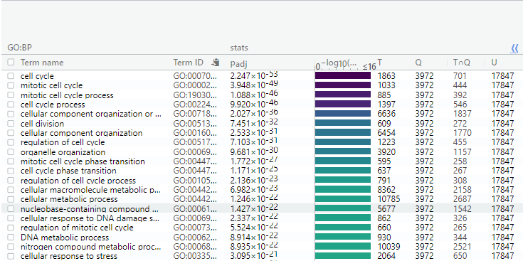
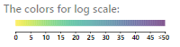
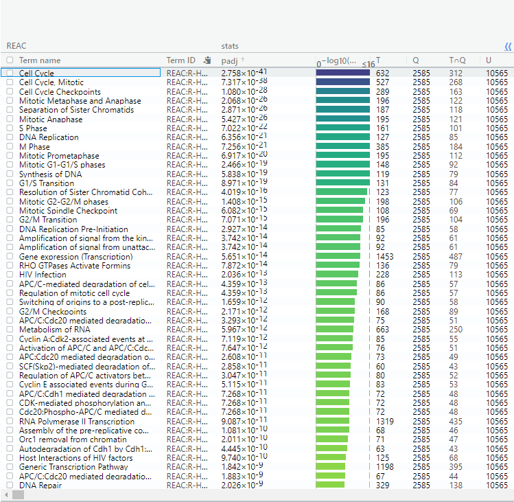
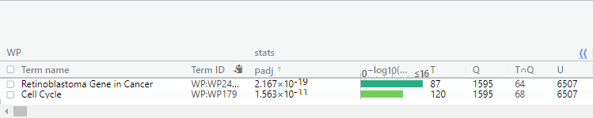
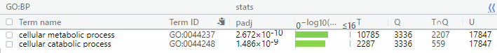
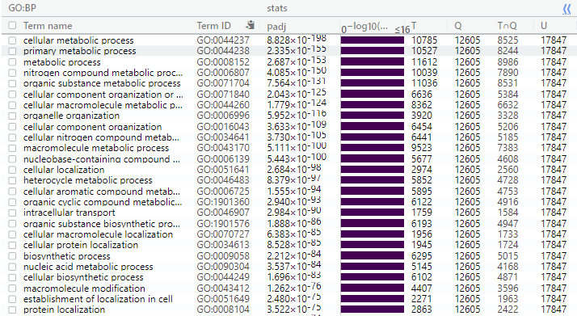
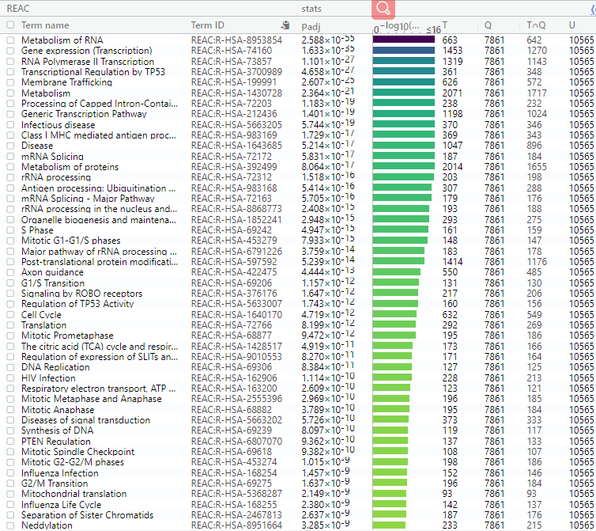
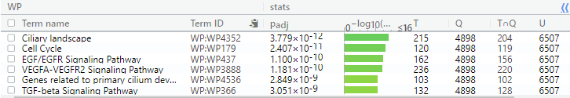

# Where the project was left
Data is from "Histone H3 lysine 4 acetylation-methylation dynamics define breast cancer subtypes [RNA-seq]" whose series number is GSE75168. It can be downloaded from GEO

The GEO description is, as a summary:

_Experiment title__: 	Histone H3 lysine 4 acetylation-methylation dynamics define breast cancer subtypes [RNA-seq]

__Experiemtn type__: Expression profiling by high throughput sequencing

__Platform title__: Illumina NextSeq 500 (Homo sapiens)

__Submission data__: Feb 10, 2016
analysis.
__LAst update data__: Mar 26 2019

__Organisms__: Homo sapiens

__Number of GEO datasets that use this techology__: 177

__Number of GEO samples that use this technology__: 4012

To define the relative roles of histone H3 methylation (H3K4me3) and acetylation (H3K4ac) in breast cancer, genomic regions are determined which are enriched for both marks in normal-like, transformed and metastatic cells. There were 3 human mammary cell lines chosen to represent a normal-like subtype, which is MCF10A, and two cancer subtypes, which are luminal MCF7 and basal-like metastatic MDA-MB-231. They recapitulate the transitional differentiation which is observed in breast cancer subtypes.And an epigenetic signature of distinct stages of cancer is defined and molecular differences leading to phenotypic changes during cancer progression are determined by esatblishing changes in H3K4me3 and H3K4ac in these three model cell lines. The experiment samples the RNA sequence of cell lines MCF10A, MCF7, and MDA-MB-231 with 3 replicates. 

Genes in data with low expression (<3 counts) were removed from the analysis.

See more description on https://www.ncbi.nlm.nih.gov/geo/query/acc.cgi?acc=GSE75168. 

The data was normalized, cleaned, and the up to date identifers from ensembl were assigned. The data with null identifers were removed from the dataframe.

# Initial setup

```{r message=FALSE, warning=FALSE, error=FALSE, results='hide'}
if (!requireNamespace("BiocManager", quietly = TRUE))
    install.packages("BiocManager")
if (!requireNamespace("limma", quietly = TRUE))
    BiocManager::install("limma")
if (!requireNamespace("ComplexHeatmap", quietly = TRUE))
  BiocManager::install("ComplexHeatmap")
if (!requireNamespace("circlize", quietly = TRUE))
  BiocManager::install("circlize")
if (!requireNamespace("Biobase", quietly = TRUE))
  BiocManager::install("Biobase")
if (!requireNamespace("edgeR", quietly = TRUE))
  BiocManager::install("edgeR")
```

# differential gene expression
## 0. Load the data with identifiers
```{r}
normalized_count_data <- read.table(file = file.path(".", "GSE75168_normalized_counts.txt"),
                                    header = TRUE, sep = "\t", stringsAsFactors = FALSE, 
                                    check.names = FALSE)

```
Take a look of the data
```{r}

head(normalized_count_data)
```
## 1. Create heatmaps for normalied coount data 
Create a numerical matrix that we can create a heatmap from 
```{r}
heatmap_matrix <- normalized_count_data[, 3:ncol(normalized_count_data)]
rownames(heatmap_matrix) <- normalized_count_data$ensembl_gene_id
colnames(heatmap_matrix) <- colnames(normalized_count_data[, 3:ncol(normalized_count_data)])
```
Create a heatmap which transtlates numbers into a colr scale over many sampoles and measurements.
```{r message=FALSE, warning=FALSE, error=FALSE}
library(ComplexHeatmap)
library(circlize)

if(min(heatmap_matrix) == 0){
  heatmap_col = circlize::colorRamp2(c(0, max(heatmap_matrix)), c("white", "red"))
} else {
  heatmap_col = circlize::colorRamp2(c(min(heatmap_matrix), 0, max(heatmap_matrix)), c("blue", "white", "red"))
}

# It turns out the code runs to the first chunk of the if condition
# which shows that there is at least one 0 in heatmap_matrix

current_heatmap <- ComplexHeatmap::Heatmap(as.matrix(heatmap_matrix),
                                           name = "matrix",
                                           show_row_dend = TRUE,
                                           show_column_dend = TRUE,
                                           col = heatmap_col,
                                           show_column_names = TRUE,
                                           show_row_names = FALSE,
                                           show_heatmap_legend = TRUE,
                                           height = unit(8, "cm"),
                                           width = unit(8, "cm"))

current_heatmap

```
Since the range of the normalized count is large, and most of count are assembled in the lower than 100 range. And the white to red from the low to the high counts color scheme is not visualized friendly. This leads to the overall white heatmap visualization.   

Using Row-normalization to generate heatmap
```{r message=FALSE, warning=FALSE, error=FALSE}
library(ComplexHeatmap)
library(circlize)

heatmap_matrix_r <- t(scale(t(heatmap_matrix)))

if(min(heatmap_matrix_r) == 0){
  heatmap_col_r = circlize::colorRamp2(c(0, max(heatmap_matrix_r)), c("white", "red"))
} else {
  heatmap_col_r = circlize::colorRamp2(c(min(heatmap_matrix_r), 0, max(heatmap_matrix_r)), c("blue", "white", "red")) 
}

current_heatmap_r <- ComplexHeatmap::Heatmap(as.matrix(heatmap_matrix_r),
                                             name = "matrix",
                                             show_row_dend = TRUE,
                                             show_column_dend = TRUE,
                                             col = heatmap_col_r,
                                             show_column_names = TRUE,
                                             show_row_names = FALSE,
                                             show_heatmap_legend = TRUE,
                                             height = unit(8, "cm"),
                                             width = unit(8, "cm"))

current_heatmap_r
```

## 2.1 Compare the expression of a single gene
To compare the expression of a single gene. Since ___KRT15___ has the highest normalized count in MCF10A in the first replication and relatively high in replaication 2 and 3 but pretty low in MDA-MB-231 and MCF7, it is picked to analyse here.
```{r}
MCF10A_samples <- grep(colnames(normalized_count_data), pattern = "^MCF10A")
MDA_samples <- grep(colnames(normalized_count_data), pattern = "^MDA")
MCF7_samples <- grep(colnames(normalized_count_data), pattern = "^MCF7")

gene_of_interest <- which(normalized_count_data$hgnc_symbol == "KRT15")

KRT15_MCF10A_samples <- t(normalized_count_data[gene_of_interest, MCF10A_samples])
colnames(KRT15_MCF10A_samples) <- c("MCF10A_samples")

KRT15_MDA_samples <- t(normalized_count_data[gene_of_interest, MDA_samples])
colnames(KRT15_MDA_samples) <- c("MDA_samples")

KRT15_MCF7_samples <- t(normalized_count_data[gene_of_interest, MCF7_samples])
colnames(KRT15_MCF7_samples) <- c("MCF7_samples")

```

Null hypothesis of the two smaple t-test is that there is ___NO___ difference in means of each sample
Test if KRT15 differentially expressed in my samples under the condition that both samples in the t.test function are normally distributed.
```{r}
t.test(x=t(KRT15_MCF10A_samples), y=t(KRT15_MCF7_samples))
t.test(x=t(KRT15_MCF10A_samples), y=t(KRT15_MDA_samples))
t.test(x=t(KRT15_MCF7_samples), y=t(KRT15_MDA_samples))
```
The results show that the p-values for three samples, no matter how they are combined to compare, are low, which leads to it is evident to reject the null hypothesis.

Therefore, it reals that for the gene ___KRT15___, there is difference in means of MCF10A, MCF7, MDA samples. This conclusion also fits the observation previously.

## 2.2 Select model for the differential gene expression analysis for all genes in my dataset

First, generate the MDSPlot to double check the picked factors in my model.
```{r message=FALSE, warning=FALSE, error=FALSE}
library(limma)

limma::plotMDS(heatmap_matrix, col = rep(c("darkgreen", "blue", "purple"), 10))
```
Since from the MDSPlot, samples are assembled in different cell line subtypes (MCF10A, MCF7, MDA-MB-231). The subtypes can be hypothesized to contribute to the differential, as the analysis in the previous single gene expression analysis.

Hence, my data will grouped based on the subtypes.
```{r}
# Define the groups
samples <- data.frame(lapply(colnames(normalized_count_data)[3:11], 
                             FUN=function(x){unlist(strsplit(x, split = "\\_"))[c(1,2)]}))
colnames(samples) <- colnames(normalized_count_data)[3:11]
rownames(samples) <- c("cell_line_subtype", "replicate")
samples <- data.frame(t(samples),
                      stringsAsFactors=FALSE)
samples
```

### 2.2.1 Limma
Try linear model, which describe a continuous response variable as a function of one or more predictor variables, for my data. First, try empirical Bayes in the limma package.

Note that since the significance of over-representation was determined by Bonferroni correction in the paper of the data [1]. To make it consistent to later process, the __adjust.method__ here is __"bonferroni"__. 
```{r message=FALSE, warning=FALSE, error=FALSE}
library(limma)
library(Biobase)

# Create a design matrix
model_design <- model.matrix(~ samples$cell_line_subtype)

# Create data matrix
expressionMatrix <- as.matrix(normalized_count_data[,3:11])
rownames(expressionMatrix) <- normalized_count_data$ensembl_gene_id
colnames(expressionMatrix) <- colnames(normalized_count_data)[3:11]
minimalSet <- Biobase::ExpressionSet(assayData = expressionMatrix)

# Fit the data to the linear model
fit <- limma::lmFit(minimalSet, model_design)

# Apply empirical Bayes to compute differential expression for the model
# Note that the higher level of parameters represents the most likely values.
fit2 <- limma::eBayes(fit, trend = TRUE)

topfit <- topTable(fit2, coef = ncol(model_design),
                   adjust.method = "bonferroni",
                   number = nrow(expressionMatrix))

# merge hgnc names to topgit table
output_hits <- merge(normalized_count_data[, 1:2], topfit,
                     by.y = 0, by.x = 1,
                     all.y = TRUE)

# sort by pvalue
output_hits <- output_hits[order(output_hits$P.Value),]

head(output_hits)

```

```{r}
sprintf("The number of genes in the data: %i", 
        as.integer(nrow(normalized_count_data)))

sprintf("The number of gene passing the threshold p-value < 0.05: %i",
        as.integer(length(which(output_hits$P.Value < 0.05))))

sprintf("The number of genes passing correction: %i", 
        as.integer(length(which(output_hits$adj.P.Val < 0.05))))

```

```{r message=FALSE, warning=FALSE, error=FALSE}
#library(edgeR)
library(limma)

# Create MAPlot
topfit_results <- topfit[rownames(minimalSet),]
topfit_status <- apply(topfit_results, 1, function(gene) {
  if (gene["logFC"] < 0 && gene["adj.P.Val"] < 0.05) {
    return("Down-regulated genes")
  } else if (gene["logFC"] > 0 && gene["adj.P.Val"] < 0.05) {
    return("Up-regulated genes")
  } else {
    return("Not differentially expressed")
  }
})

#qlf_output_hits_status

limma::plotMD(fit2, column = ncol(fit2), status = topfit_status,
              cex = 0.5, main = "MAplot of replication in Limma")
```

As the number of tests performed increases the likelihood that a positive results will occur simply by chance increases, it should be controlled for family-wise error rate or for false discovery rate. 

Hence, I try to improve the results if we account for the replicate variability.

The __adjust.method__ here is __"bonferroni"__ again.
```{r message=FALSE, warning=FALSE, error=FALSE}
library(limma)

# Create a new design matrix
model_design_rep <- model.matrix(~ samples$replicate + samples$cell_line_subtype)

# Fit the data to the model
fit_rep <- limma::lmFit(minimalSet, model_design_rep)

# Apply empirical Bayes to compute differential expression for the model
# Note that the higher level of parameters represents the most likely values.
fit2_rep <- limma::eBayes(fit_rep, trend = TRUE)

topfit_rep <- topTable(fit2_rep, coef = ncol(model_design_rep),
                   adjust.method = "bonferroni",
                   number = nrow(expressionMatrix))

# merge hgnc names to topgit table
output_hits_rep <- merge(normalized_count_data[, 1:2], topfit_rep,
                     by.y = 0, by.x = 1,
                     all.y = TRUE)

# sort by pvalue
output_hits_rep <- output_hits_rep[order(output_hits_rep$P.Value),]

head(output_hits_rep) 
```

```{r}
sprintf("The number of genes in the data: %i", 
        as.integer(nrow(normalized_count_data)))

sprintf("The number of gene passing the threshold p-value < 0.05: %i",
        as.integer(length(which(output_hits_rep$P.Value < 0.05 ))))

sprintf("The number of genes passing correction: %i", 
        as.integer(length(which(output_hits_rep$adj.P.Val < 0.05 ))))
```
The thresholds of p-value for both models are set as 0.05 to adjust the p-values to account for the fact that each time there is a 5% chance my finding is obtained by chance.

```{r message=FALSE, warning=FALSE, error=FALSE}
#library(edgeR)
library(limma)

# Create MAPlot
topfit_rep_results <- topfit_rep[rownames(minimalSet),]
topfit_rep_status <- apply(topfit_rep_results, 1, function(gene) {
  if (gene["logFC"] < 0 && gene["adj.P.Val"] < 0.05) {
    return("Down-regulated genes")
  } else if (gene["logFC"] > 0 && gene["adj.P.Val"] < 0.05) {
    return("Up-regulated genes")
  } else {
    return("Not differentially expressed")
  }
})

limma::plotMD(fit2_rep, column = ncol(fit2_rep), status = topfit_rep_status, 
              cex = 0.5,
              main = "MAplot of replication in Limma")


```

Compare the results from these two models by plot. Note that all p-values are initialized as ___black___. All p-value in the first model passing the threshold p-vale < 0.05 is colored in ___orange___, and the ones in the second model is colored in ___blue___. The genes passing both models are colored in ___red___. 
```{r}
simple_model_pvalues <- data.frame(ensembl_id = output_hits$ensembl_gene_id,
                                   simple_pvalue = output_hits$P.Value)
rep_model_pvalues <- data.frame(ensembl_id = output_hits_rep$ensembl_gene_id,
                                replicate_pvalue = output_hits_rep$P.Value)

two_models_pvalues <- merge(simple_model_pvalues, 
                            rep_model_pvalues,
                            by.x = 1, by.y = 1)

# Color each genes by its p-value, as well as checking if the number of each color matches to the number of genes passing threshold in different models (in comments so will not run directly)
two_models_pvalues$color <- "black"
#length(which(two_models_pvalues$color == "black")) == nrow(two_models_pvalues)

two_models_pvalues$color[which(two_models_pvalues$simple_pvalue < 0.05)] <- "orange"
#length(which(two_models_pvalues$color == "orange")) == length(which(simple_model_pvalues$simple_pvalue < 0.05))

two_models_pvalues$color[which(two_models_pvalues$replicate_pvalue < 0.05)] <- "blue"
#length(which(two_models_pvalues$color == "blue")) == length(which(rep_model_pvalues$replicate_pvalue < 0.05))

two_models_pvalues$color[which(two_models_pvalues$simple_pvalue < 0.05 & two_models_pvalues$replicate_pvalue < 0.05)] <-"red"
#length(which(two_models_pvalues$color == "red")) == length(which(two_models_pvalues$simple_pvalue < 0.05 & two_models_pvalues$replicate_pvalue < 0.05))

#length(which(two_models_pvalues$color != "black")) == length(which(two_models_pvalues$simple_pvalue < 0.05 | two_models_pvalues$replicate_pvalue < 0.05 | (two_models_pvalues$simple_pvalue < 0.05 & two_models_pvalues$replicate_pvalue < 0.05)))

#length(which(two_models_pvalues$color != "black"))/nrow(two_models_pvalues)

# MAPlot
plot(two_models_pvalues$simple_pvalue, two_models_pvalues$replicate_pvalue,
     col = two_models_pvalues$color,
     xlab = "Simple model p-values",
     ylab = "Replicate model p-values",
     main = "Simple vs Replicate Limma")
```

Highlight the gene of interest in MAPlot in ___red___ and the rest turns in ___grey___.
```{r}
ensembl_of_interest <- normalized_count_data$ensembl_gene_id[which(normalized_count_data$hgnc_symbol == "KRT15")]

two_models_pvalues$color <- "grey"
two_models_pvalues$color[which(two_models_pvalues$ensembl_id == ensembl_of_interest)] <- "red"

# Plot in MAPlot
plot(two_models_pvalues$simple_pvalue, two_models_pvalues$replicate_pvalue,
     col = two_models_pvalues$color,
     xlab = "Simple model p-values",
     ylab = "Replicate model p-values",
     main = "Simple vs Replicate Limma")

# Since the gene of interest color is blocked in the plot, add it after generating the plot manually.
points(two_models_pvalues$simple_pvalue[two_models_pvalues$color == "red"], 
       two_models_pvalues$replicate_pvalue[two_models_pvalues$color == "red"],
       col = "red")

```
It turns that the p-value of the gene of interest, KRT15, passed the threshold of p-value for both of models. 

### 2.2.2 EdgeR

Model will be used here is glmQLFTest, which estimates the quasi-likelihood (QL) that is used for more complicated models and is highly recommended for bulk RNASeq expreiments. The threshold of p-value here will still be smaller than 0.05 to unified filter of the results to previous model results.   
```{r message=FALSE, warning=FALSE, error=FALSE}
library(edgeR)

# set up edgeR pbjects
data_matrix <- as.matrix(normalized_count_data[, 3:11])
rownames(data_matrix) <- normalized_count_data$ensembl_gene_id
d = edgeR::DGEList(counts = data_matrix, group = samples$cell_line_subtype)

# estimate dispersion
d <- edgeR::estimateDisp(d, model_design)

# Fit the model
fit <- glmQLFit(d, model_design)

# calculate differential expression using the Quasi likelihood model
qlf.cell_line_sub <- edgeR::glmQLFTest(fit, coef = 'samples$cell_line_subtypeMDA-MB-231')

# Get all results
qlf_output_hits <- edgeR::topTags(qlf.cell_line_sub, sort.by = "PValue",
                                  n = nrow(normalized_count_data))

sprintf("The number of genes: %i",
        nrow(qlf.cell_line_sub))

sprintf("The number of genes passing the threshold p-value < 0.05: %i", 
        length(which(qlf_output_hits$table$PValue < 0.05)))

sprintf("The number of genes passing correction: %i", 
        length(which(qlf_output_hits$table$FDR < 0.05)))

```

```{r message=FALSE, warning=FALSE, error=FALSE}
# MAPlot
#library(edgeR)
library(limma)

qlf_results <- qlf.cell_line_sub[rownames(minimalSet),]

qlf_status <- apply(qlf_results$table, 1, function(gene) {
  if (gene["logFC"] < 0 && gene["PValue"] < 0.05) {
    return("Down-regulated genes")
  } else if (gene["logFC"] > 0 && gene["PValue"] < 0.05) {
    return("Up-regulated genes")
  } else {
    return("Not differentially expressed")
  }
})

#qlf_output_hits_status
limma::plotMD(fit, column = ncol(fit), status = qlf_status,
              cex = 0.5, 
              main = "MAplot of cell-line subtypes")
```

Compare the result of this model to the result of cell line subtype model, which are the comparison of limma and quasi likelihood.
```{r}

qlf_model_pvalues <- data.frame(ensembl_id = rownames(qlf_output_hits),
                                qlf_pvalues = qlf_output_hits$table$PValue)

limma_model_pvalues<- data.frame(ensembl_id = output_hits$ensembl_gene_id,
                                 limma_pvalues = output_hits$P.Value)

two_models_pvalues_lq <- merge(qlf_model_pvalues, limma_model_pvalues, 
                            by.x = 1, by.y = 1)

#qlf_model_pvalues
#limma_model_pvalues
#two_models_pvalues

two_models_pvalues_lq$color <- "black"
two_models_pvalues_lq$color[which(two_models_pvalues_lq$qlf_pvalues < 0.05)] <- "orange"
two_models_pvalues_lq$color[which(two_models_pvalues_lq$limma_pvalues < 0.05)] <- "blue"
two_models_pvalues_lq$color[which(two_models_pvalues_lq$qlf_pvalues < 0.05 & two_models_pvalues_lq$limma_pvalues < 0.05)] <- "red"

#length(which(two_models_pvalues$qlf_pvalues < 0.05 & two_models_pvalues$limma_pvalues < 0.05))

# Plot
plot(two_models_pvalues_lq$qlf_pvalues, two_models_pvalues_lq$limma_pvalues,
     col = two_models_pvalues_lq$color,
     xlab = "QLF model p-values", ylab = "Limma model p-values",
     main = "QLF vs Limma")


```
It shows that most of p-values for each gene in two models are divergent. 

```{r}
ensembl_of_interest <- normalized_count_data$ensembl_gene_id[which(normalized_count_data$hgnc_symbol == "KRT15")]

two_models_pvalues_lq$color <- "grey"
two_models_pvalues_lq$color[two_models_pvalues_lq$ensembl_id == ensembl_of_interest] <- "red"

# MAPlot 
plot(two_models_pvalues_lq$qlf_pvalues, two_models_pvalues_lq$limma_pvalues,
     col = two_models_pvalues_lq$color,
     xlab = "QLF model p-values",
     ylab = "Limma model p=values",
     main = "QLF vs Limma")
     
points(two_models_pvalues[two_models_pvalues_lq$ensembl_id == ensembl_of_interest, 2:3], 
       pch = 24, col = "red", cex = 1.5)
```

## 2.3. Visualize the top hits accounting for cell line subtypes variability whose p-value < 0.05 using a heatmap

### 2.3.1 Heatmap for limma models
For limma model, by the comparison of the number of gene passing the threshold of p-value < 0.05 in cell-line subtypes model and replicate model above, the model for cell-line sutypes is used.
```{r message=FALSE, warning=FALSE, error=FALSE}
library(ComplexHeatmap)
library(circlize)

top_hits <- output_hits$ensembl_gene_id[output_hits$P.Value < 0.05]
heatmap_matrix_tophits <- t(scale(t(heatmap_matrix[which(rownames(heatmap_matrix) %in% top_hits),])))
#head(heatmap_matrix_tophits)

if(min(heatmap_matrix_tophits) == 0){
  heatmap_col_th = circlize::colorRamp2(c(0, max(heatmap_matrix_tophits)), c("white", "red"))
} else {
  heatmap_col_th = circlize::colorRamp2(c(min(heatmap_matrix_tophits), 0, max(heatmap_matrix_tophits)), c("blue", "white", "red"))
}

current_heatmap <- ComplexHeatmap::Heatmap(as.matrix(heatmap_matrix_tophits),
                                           name = "matrix",
                                           cluster_rows = TRUE,
                                           cluster_columns = TRUE, 
                                           show_row_dend = TRUE,
                                           show_column_dend = TRUE,
                                           col = heatmap_col_th,
                                           show_column_names = TRUE,
                                           show_row_names = FALSE,
                                           show_heatmap_legend = TRUE,
                                           height = unit(8, "cm"),
                                           width = unit(8, "cm"))

current_heatmap
```

Sort the columns by replication times
```{r message=FALSE, warning=FALSE, error=FALSE}
library(ComplexHeatmap)
library(circlize)

heatmap_matrix_tophits <- heatmap_matrix_tophits[, c(grep(colnames(heatmap_matrix_tophits), 
                                                          pattern = "\\R1"), 
                                                     grep(colnames(heatmap_matrix_tophits), 
                                                          pattern = "\\R2"),
                                                     grep(colnames(heatmap_matrix_tophits),
                                                          pattern = "\\R3"))]
#head(heatmap_matrix_tophits)

if(min(heatmap_matrix_tophits) == 0){
  heatmap_col_th = circlize::colorRamp2(c(0, max(heatmap_matrix_tophits)), c("white", "red"))
} else {
  heatmap_col_th = circlize::colorRamp2(c(min(heatmap_matrix_tophits), 0, max(heatmap_matrix_tophits)), c("blue", "white", "red"))
}

current_heatmap <- ComplexHeatmap::Heatmap(as.matrix(heatmap_matrix_tophits),
                                           name = "matrix",
                                           cluster_rows = TRUE,
                                           cluster_columns = FALSE, 
                                           show_row_dend = TRUE,
                                           show_column_dend = TRUE,
                                           col = heatmap_col_th,
                                           show_column_names = TRUE,
                                           show_row_names = FALSE,
                                           show_heatmap_legend = TRUE,
                                           height = unit(8, "cm"),
                                           width = unit(8, "cm"))

current_heatmap
```

Try to lower the threshold of p-value to 0.01 to get a slightly cleaner map.
```{r message=FALSE, warning=FALSE, error=FALSE}
library(ComplexHeatmap)
library(circlize)

top_hits <- output_hits$ensembl_gene_id[output_hits$P.Value < 0.01]
heatmap_matrix_tophits <- t(scale(t(heatmap_matrix[which(rownames(heatmap_matrix) %in% top_hits),])))
#head(heatmap_matrix_tophits)

#heatmap_matrix_tophits <- heatmap_matrix_tophits[, c(grep(colnames(heatmap_matrix_tophits), 
#                                                          pattern = "\\R1"), 
#                                                     grep(colnames(heatmap_matrix_tophits), 
#                                                          pattern = "\\R2"),
#                                                     grep(colnames(heatmap_matrix_tophits),
#                                                          pattern = "\\R3"))]

if(min(heatmap_matrix_tophits) == 0){
  heatmap_col_th = circlize::colorRamp2(c(0, max(heatmap_matrix_tophits)), c("white", "red"))
} else {
  heatmap_col_th = circlize::colorRamp2(c(min(heatmap_matrix_tophits), 0, max(heatmap_matrix_tophits)), c("blue", "white", "red"))
}

current_heatmap <- ComplexHeatmap::Heatmap(as.matrix(heatmap_matrix_tophits),
                                           name = "matrix",
                                           cluster_rows = TRUE,
                                           cluster_columns = FALSE, 
                                           show_row_dend = TRUE,
                                           show_column_dend = FALSE,
                                           col = heatmap_col_th,
                                           show_column_names = TRUE,
                                           show_row_names = FALSE,
                                           show_heatmap_legend = TRUE,
                                           height = unit(8, "cm"),
                                           width = unit(8, "cm"))

current_heatmap
```

### 2.3.2 Heatmap for edgeR model

For quasi model, the model for cell-line sutypes is used.
```{r message=FALSE, warning=FALSE, error=FALSE}
library(ComplexHeatmap)
library(circlize)

top_hits <- rownames(qlf_output_hits$table)[output_hits$P.Value < 0.05]
heatmap_matrix_tophits <- t(scale(t(heatmap_matrix[which(rownames(heatmap_matrix) %in% top_hits),])))

if(min(heatmap_matrix_tophits) == 0){
  heatmap_col_th = circlize::colorRamp2(c(0, max(heatmap_matrix_tophits)), c("white", "red"))
} else {
  heatmap_col_th = circlize::colorRamp2(c(min(heatmap_matrix_tophits), 0, max(heatmap_matrix_tophits)), 
                                        c("blue", "white", "red"))
}

current_heatmap <- ComplexHeatmap::Heatmap(as.matrix(heatmap_matrix_tophits),
                                           name = "matrix",
                                           cluster_rows = TRUE,
                                           cluster_columns = TRUE, 
                                           show_row_dend = TRUE,
                                           show_column_dend = TRUE,
                                           col = heatmap_col_th,
                                           show_column_names = TRUE,
                                           show_row_names = FALSE,
                                           show_heatmap_legend = TRUE,
                                           height = unit(8, "cm"),
                                           width = unit(8, "cm"))

current_heatmap
```

Sort the columns by cell line subtypes
```{r message=FALSE, warning=FALSE, error=FALSE}
library(ComplexHeatmap)
library(circlize)

top_hits <- rownames(qlf_output_hits$table)[output_hits$P.Value < 0.05] 
heatmap_matrix_tophits <- t(scale(t(heatmap_matrix[which(rownames(heatmap_matrix) %in% top_hits),]))) 
heatmap_matrix_tophits<- heatmap_matrix_tophits[,c(grep(colnames(heatmap_matrix_tophits),
                                                        pattern = "\\R1"),
                                                   grep(colnames(heatmap_matrix_tophits),
                                                        pattern = "\\R2"),
                                                   grep(colnames(heatmap_matrix_tophits),
                                                        pattern = "\\R3"))]

if(min(heatmap_matrix_tophits) == 0){
  heatmap_col_th = circlize::colorRamp2(c(0, max(heatmap_matrix_tophits)), 
                                        c( "white", "red"))
} else {
  heatmap_col_th = circlize::colorRamp2(c(min(heatmap_matrix_tophits), 0, max(heatmap_matrix_tophits)), 
                                        c("blue", "white", "red"))
}

current_heatmap <- ComplexHeatmap::Heatmap(as.matrix(heatmap_matrix_tophits),
                                           name = "matrix",
                                           cluster_rows = TRUE,
                                           cluster_columns = FALSE, 
                                           show_row_dend = TRUE,
                                           show_column_dend = FLASE,
                                           col = heatmap_col_th,
                                           show_column_names = TRUE,
                                           show_row_names = FALSE,
                                           show_heatmap_legend = TRUE,
                                           height = unit(8, "cm"),
                                           width = unit(8, "cm"))

current_heatmap
```

# thresholded over-representation analysis

## Choose method

By the results of different models in differential genes expression, it demonstrates that using ___cell line___ subtype as factor is better than using replication times ___in Bonferroni method in Limma___.The number of genes passing the threshold of p-value < 0.05 in ___Quasi likelihood___ is much smaller than the ones ___in Bonferroni method in Limma___, though the numbers of genes passing the correction approaches to the number of genes passing the threshold 0.05 in ___Quasi likelihood___. In addition, the heatmap of ___Limma model___ is much cleaner than the one of ___Quasi likelihood___ which is especially revealled in the group of the subtype MCF7. Therefore, the following will use ___Bonferroni method in Limma___ to perform pathway enrichment analysis.

## Check the number of up-regulated and down-regulated genes

```{r}
sprintf("The number of gene passing the threshold p-value < 0.05: %i",
        as.integer(length(which(output_hits$P.Value < 0.05))))

sprintf("The number of genes which are up regulated: %i", 
        as.integer(length(which(output_hits$P.Value < 0.05 & output_hits$logFC > 0))))

sprintf("The number of genes which are down regulated: %i", 
        as.integer(length(which(output_hits$P.Value < 0.05 & output_hits$logFC < 0))))

```

## Create threshold lists of genes and save them into local

```{r}
output_hits_withgn <- output_hits

output_hits_withgn[, "rank"] <- -log(output_hits_withgn$P.Value, base = 10) * sign(output_hits_withgn$logFC)
output_hits_withgn <- output_hits_withgn[order(output_hits_withgn$rank),]

upregulated_genes <- output_hits_withgn$hgnc_symbol[which(output_hits_withgn$P.Value < 0.05 & output_hits_withgn$logFC > 0)]
downregulated_genes <- output_hits_withgn$hgnc_symbol[which(output_hits_withgn$P.Value < 0.05 & output_hits_withgn$logFC < 0)]

write.table(x = upregulated_genes,
            file = file.path(".", "upregulated_genes.txt"), 
            sep = "\t", quote = FALSE,
            row.names = FALSE, col.names = FALSE)
write.table(x = downregulated_genes,
            file = file.path(".", "downregulated_genes.txt"), 
            sep = "\t", quote = FALSE,
            row.names = FALSE, col.names = FALSE)

write.table(x = data.frame(genename = output_hits_withgn$hgnc_symbol,
                           F_stat = output_hits_withgn$rank),
            file = file.path(".", "ranked_genelist.txt"),
            sep = "\t", quote = FALSE,
            row.names = FALSE, col.names = FALSE)

```
Thresholded list is easy to use and access; its results are quick and fast; and there are many online tools for it, though many weak signals which can contribute to the whole are ignored and theresults depends on the threshold. Three list files are generated here, __upregulated_genes.txt__ and __downregulated_genes.txt__ are thresholded lists, which can be accessed over-representation using ___g:profiler___ later. 

## Over-representation analysis

___g:profiler___ (https://biit.cs.ut.ee/gprofiler/gost) will be used as the over-representation analysis tools. It is a web server constructed by Reimand et.al from 2007. 
In g:profiler, up regulated genes thresholded list and down regulated genes thresholded list are used as the query respectively. The organisms is chosen as __Homo sapiens__. In advanced options, Bonferroni correction is set as the significance threshold for the same reason in setting "bonferroni" as the adjust method in Limma, and the threshold is set as 4.9x10^(-9) since according to the paper[1], significance of over-representation was determined with a p-value threshold of 4.9x10^(-9) after Bonferroni correction. In Data sources, the following annotations are selected:
___GO biological process___: latest releases on 7.1.2019
___Reactome___: ensembl classes; latest releases on 10.2.2019
___WikiPathways___: latest releases on 9.10.2019

Select the Ensembl ID with the most GO annotations for all genes with multiple Ensembl IDs.

For up-regulated genes:

___Figure 1.___ The screenshot of top 20 GO biological process (GO:BP) terms with their statistical values in up-regulated genes




There are 85 terms returned in GO:BP under the threshold 4.9x10^(-9).

___Figure 2.___ The screenshot of all Reactome (REAC) terms with their statistical values in up-regulated genes



There are 46 terms returned in REAC under the threshold 4.9x10^(-9)

___Figure 3.___ The screenshot of all WikiPathways (WP) terms with their statistical values in up-regulated genes



There are 2 terms returned in WP under the threshold 4.9x10^(-9)

Overall, the up-regulated genes were enriched for 85 GO:BC terms, 46 Reactome terms, and 2 WikiPathways terms. 


For down-regulated genes:

___Figure 4.___ The screenshot of all GO biological process (GO:BP) terms with their statistical values in down-regulated genes



There are 2 terms returned in GO:BP under the threshold 4.9x10^(-9).

Overall, the down-regulated genes were enriched for only 2 GO:BC. And there is no enriched genes from Reactome and WikiPathways data sources.


For all differentialy expressed genes:

___Figure 5.___ The screenshot of top 20 GO biological process (GO:BP) terms with their statistical values in all differentially expressed genes



There are 361 terms returned in GO:BP under the threshold 4.9x10^(-9).

___Figure 6.___ The screenshot of all Reactome (REAC) terms with their statistical values in all differentially expressed genes



There are 47 terms returned in REAC under the threshold 4.9x10^(-9).

___Figure 7.___ The screenshot of all WikiPathways (WP) terms with their statistical values in all differentially expressed genes



There are 6 terms returned in WP under the threshold 4.9x10^(-9).

Overall, all differentially expressed genes were enriched for 361 GO biological process terms, 47 Reactome terms, and 6 WikiPathways terms. 

As a whole, since the non of number of significant enriched terms, which are defined under the threshold of p-value < 4.9*10^(-9), in all data sources is too many (e.g. over 1000). Therefore, there is no need to further restrcit the returned genesets. 

Most of differentially expressed genes are up-regulated in all selected data sources (85 up-regulated genesets from 361 genesets in GO biological process, which is 23.5%; 46 out of 47 in Reac, which is 97.9%; and 2 out of 6 in WP, which is 33%) while only 2 out of 361 genesets are down-regulated in GO biological process. 

By T number for each geneset, the number of genes in each dataset term can be found, and the number of genes from my query is shown by Q number. Therefore, the number of genes from my query can be found in corresponding genesets is in T union Q. 

The geneset of the highest number of genes from my query which can be found in corresponding genesets in data source GO biological process is ___cellular metabolic process___ in all differentialy expressed genes. It is also the largest one in the down-regulated genes. However, the geneset of the highest number of genes from my query can be found in corresponding genesets in data source GO biological process is ___cell cycle___ in up-regulated genes, which relates to cellular metabolic process, but it is even not in top 20 in differentially expressed genes. 

The geneset of the highest number of genes from my query which can be found in corresponding genesets in data source Reatome is also ___cell cycle___ followed by ___gene expression___ in all differentially expressed genes though the one is metabolism of RNA in up-regulated genes, which is highly related to cell cycle but has a higher p-value in all differentially expressed genes than cell cycle geneset in Reatome data source.

The geneset of the highest number of genes from my query which can be found in corresponding genesets in data source WikiPathways is ___Ciliary landscape___ and the geneset of the next highest is ___Cell cycle___. The geneset of the highest number of genes from my query which can be found in corresponding geneset in the data source WikiPathways in up-regulated genes is ___Retinoblastoma gene in cancer___ which is not in the all differentially expressed genes. However, the next highest is also ___Cell cycle___ in the up-regulated genes.

These results are consistent to the results in paper[1]. In paper, top 2% from the ranked list of differentially expressed genes are subjected to GO analysis, and GO terms were related to regulation of metabolic process, and cellular macromolecular metabolic process, etc. My observation in Reactome and WikiPathways data source also support their results. The results are also consistent to the paper reviewing molecular subtypes of breast cancer [2]. The paper demonstrates that one of the molecular subtype of triple negative breast cancer (TNBC), basal-like 1 (BL1), usually have high Ki67 proliferative indices while their expression profile is enriched in genes associated with basal cytokeratin gene, cell cycle, and DNA damage response pathways.And my results also show that my genes are enriched in geneset cell cycle. Thus, my results are supported.


# Reference
[1] Messier TL, Gordon JA, Boyd JR, Tye CE et al. Histone H3 lysine 4 acetylation and methylation dynamics define breast cancer subtypes. Oncotarget 2016 Feb 2;7(5):5094-109. PMID: 26783963

[2] Fragomeni SM, Sciallis A, Jeruss JS. Molecular subtypes and local-regional control of breast cancer. Surg Oncol Clin A Am 2018 Jan; 27(1): 95-120. PMID: 29132568