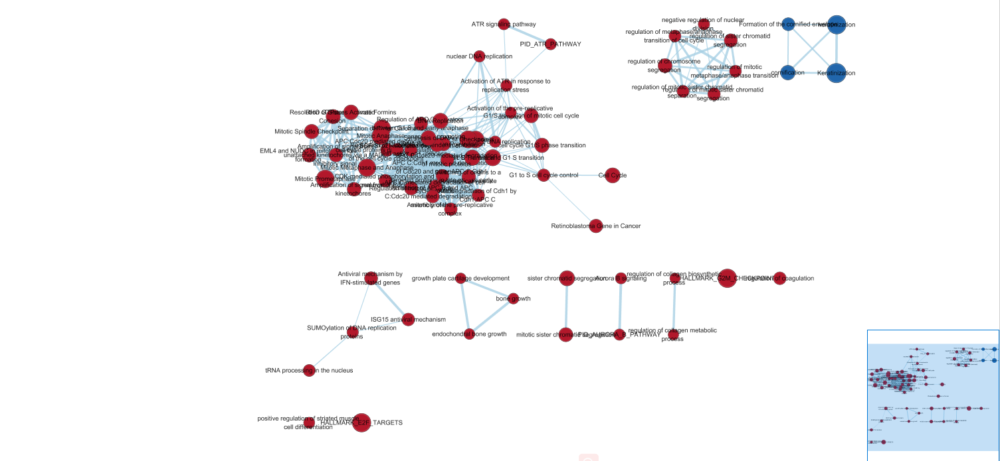
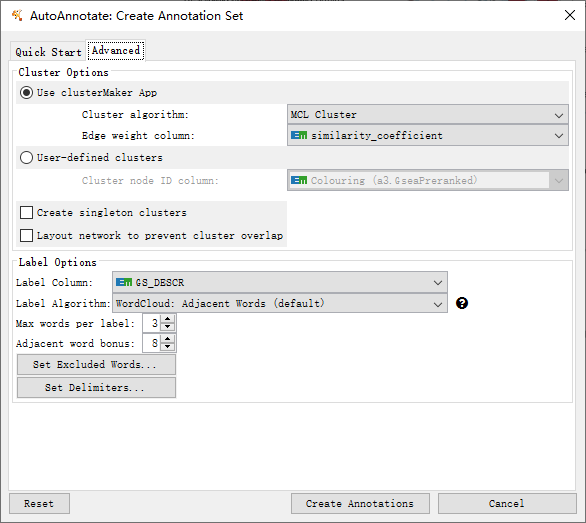
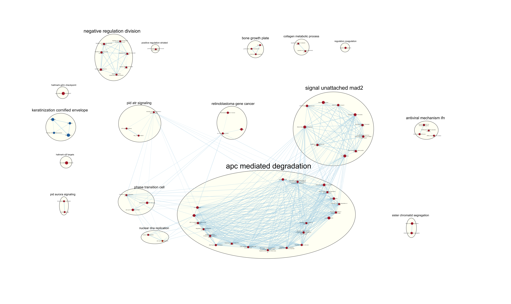
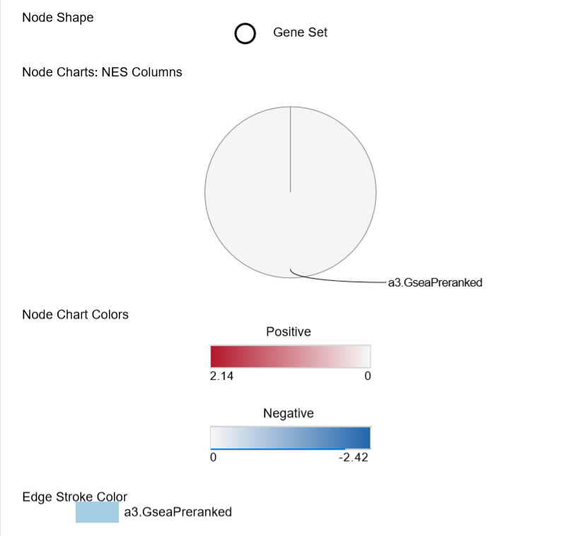
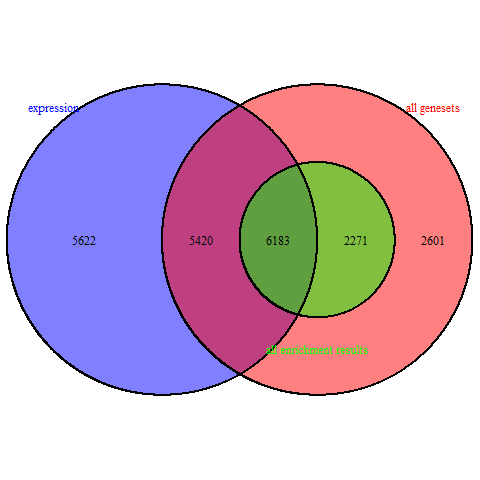
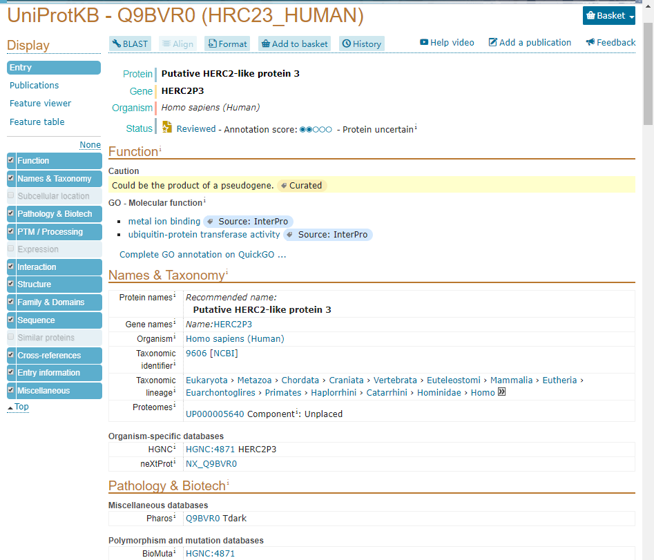

# Where the project was left
Data is from "Histone H3 lysine 4 acetylation-methylation dynamics define breast cancer subtypes [RNA-seq]" whose series number is GSE75168. It can be downloaded from GEO

The GEO description is, as a summary:

__Experiment title__: 	Histone H3 lysine 4 acetylation-methylation dynamics define breast cancer subtypes [RNA-seq]

__Experiemtn type__: Expression profiling by high throughput sequencing

__Platform title__: Illumina NextSeq 500 (Homo sapiens)

__Submission data__: Feb 10, 2016
analysis.
__LAst update data__: Mar 26 2019

__Organisms__: Homo sapiens

__Number of GEO datasets that use this techology__: 177

__Number of GEO samples that use this technology__: 4012

To define the relative roles of histone H3 methylation (H3K4me3) and acetylation (H3K4ac) in breast cancer, genomic regions are determined which are enriched for both marks in normal-like, transformed and metastatic cells. There were 3 human mammary cell lines chosen to represent a normal-like subtype, which is MCF10A, and two cancer subtypes, which are luminal MCF7 and basal-like metastatic MDA-MB-231. They recapitulate the transitional differentiation which is observed in breast cancer subtypes.And an epigenetic signature of distinct stages of cancer is defined and molecular differences leading to phenotypic changes during cancer progression are determined by esatblishing changes in H3K4me3 and H3K4ac in these three model cell lines. The experiment samples the RNA sequence of cell lines MCF10A, MCF7, and MDA-MB-231 with 3 replicates. 

Genes in data with low expression (<3 counts) were removed from the analysis.

See more description on https://www.ncbi.nlm.nih.gov/geo/query/acc.cgi?acc=GSE75168. 

The data was normalized, cleaned, and the up to date identifers from ensembl were assigned. The data with null identifers were removed from the dataframe. The data had also been processed to differential gene expression and the thresholded over-representation analysis. It is found that the functions of the geneset are consistent to the results in its original paper[1] which are related to the regulation of metabolic process.

To access Assignment #2 report, here is the link https://htmlpreview.github.io/?https://github.com/bcb420-2020/student_MichelleMengzhi/blob/master/A2.html .

# Non-thresholded Gene set Enrichment Analysis

## Perform non-thresholded gene set enrichment analysis by GSEA
I would like to use GSEA method to do this. From Assignment 2, the file of ranked genelist with rank score was generated and its name is __ranked_genelist.rnk__. To run GSEA, we also need genesets from Bader lab (http://download.baderlab.org/EM_Genesets/February_01_2020/Human/) from February 1, 2020 containing GO biological process, no IEA and pathways. The file name gotten from the web is __Human_GOBP_AllPathways_no_GO_iea_February_01_2020_symbol.gmt__. Since I have prepared unique human gene symbols ranked list, in Collapse section, 'No_collapse' is selected. Geneset permutation is set as 1000. Max size is 2000 and min size is 15 to eliminate the geneset which is less than 15 or longer than 200 to reduce the run time.

## Summarize the enrichment results:

* The top term in POS:
  + HALLMARK_E2F_TARGETS%MSIGDB_C2%HALLMARK_E2F_TARGETS
  + p-value: 0
  + ES: 0.60
  + NES: 2.14
  + FDR: 0
  + How many genes in its leading edge: 195
  + What is the top gene associated with this geneset: CDKN3
  
* The top term in NEG:
  + KERATINIZATION%GOBP%GO:0031424
  + p-value: 0
  + ES: -0.61
  + NES: -2.42
  + FDR: 0
  + How many genes in its leading edge: 52
  + What is the top gene associated with this geneset: KRT34
  
## Compare the results to the results from the thresholded analysis in Assignment #2 (A2)

Note that the results from g:profile in A2 can be accessed by the link in the top section _Where the project was left_.
The top results in A2 from g:profiler in both up and down regulated genes are related to cellular metabolic process. The highest term in up-regulated genes is cell cycle. In GSEA, the top term in POS is Hallmark E2F target, which is genes encoding cell cycle related targets of E2F transcription factors according to GSEA molecular signature database (https://www.gsea-msigdb.org/gsea/msigdb/cards/HALLMARK_E2F_TARGETS).The highest term in down-regulated genes is cellular metabloic process, while in GSEA, the top term in NEG is Keratinization, which is a process in which the cytoplasm of the outermost cells of the vertebrate epidermis is replaced by keratin according to GSEA molecular signature database (https://www.gsea-msigdb.org/gsea/msigdb/cards/GO_KERATINIZATION), and is also related to metabolic process. 

Therefore, this is a straight forward comparison.

In addition, these results are consistent to the results in paper[1]. In paper, top 2% from the ranked list of differentially expressed genes are subjected to GO analysis, and GO terms were related to regulation of metabolic process, and cellular macromolecular metabolic process, etc. My observation in Reactome and WikiPathways data source also support their results. The results are also consistent to the paper reviewing molecular subtypes of breast cancer [2]. The paper demonstrates that one of the molecular subtype of triple negative breast cancer (TNBC), basal-like 1 (BL1), usually have high Ki67 proliferative indices while their expression profile is enriched in genes associated with basal cytokeratin gene, cell cycle, and DNA damage response pathways.And my results also show that my genes are enriched in geneset cellular metabolic process which relates to cell cycle. Thus, my results are supported.

# Visualize the Gene set Enrichment Analysis in Cytoscape

## Create an enrichment map

After createing the enrichment map by Cytoscape. 

* Number of edges: 389
* Number of nodes: 70
* Threshold used to create the map: 
  + FDR : 0.01
  + p-value: 1.0
  + NES: All
  + Cutoff of number of edges: 0.375
  + The rest is in default
  


Figure 1. The screenshot of the network prior to manual layout

## Annotate the network

Use __Auto Annotate__ from Apps in Cytoscape, create new annotation set, annotate the entire network and check the check box for layout network to prevent cluster overlap. Leave all advanced setting in default.



Figure 2. The screenshot of the default advanced setting in AutoAnnotate.

Then manually drag each clusters to make sure no labels overlap

## Make a publication ready figure


Figure 3. The screenshot of enrichment map with annotation from Cytoscape.

Figure 4. The legend of the enrichment map form Cytoscape. 

## Collapse the network to a theme network

Nodes are collapsed by __Auto Annotate__. In its control pnael, select collapse all. 

The major themes are signal unttached mad2, apc mediated degradation, nuclear dna repliaction, phase transition cell, pid atr signaling, retinoblastoma gene cancer. Take a look of their nodes and it is found that their terms are highly related to cell cycle, which fits the model.

# Dark matters

In this section, we would like to highlight any genes that are significantly differentially expressed in your model but are not annotated to any pathways
```{r message=FALSE, warning=FALSE, error=FALSE, results='hide', echo=FALSE}
if (! requireNamespace("GSA", quietly=TRUE)) {
  install.packages("GSA")
}
library(GSA)
if (! requireNamespace("VennDiagram", quietly=TRUE)) {
  install.packages("VennDiagram")
}
if (!requireNamespace("BiocManager", quietly = TRUE))
    install.packages("BiocManager")
if (!requireNamespace("pheatmap", quietly = TRUE))
  BiocManager::install("pheatmap")

All_genesets<- GSA.read.gmt("./Human_GOBP_AllPathways_no_GO_iea_February_01_2020_symbol.gmt")
```

```{r}
names(All_genesets$genesets) <- All_genesets$geneset.names

# Load expression file + rank file
expression <- read.table(file.path(getwd(),".", "ranked_genelist.txt"), 
                         header = TRUE, sep = "\t", quote="\"", stringsAsFactors = FALSE)
ranks <- read.table(file.path(getwd(),".","ranked_genelist.rnk"), 
                    header = TRUE, sep = "\t", quote="\"",  
                    stringsAsFactors = FALSE)

# Load GSEA results file
gsea_directories <- list.files(path = file.path(getwd(),"."), 
                                 pattern = "\\GseaPreranked")
if(length(gsea_directories) == 1){
  gsea_dir <- file.path(getwd(),".",gsea_directories[1])
  #get the gsea result files
  gsea_results_files <- list.files(path = gsea_dir, 
                                 pattern = "gsea_report_*.*.xls")
  #there should be 2 gsea results files
  enr_file1 <- read.table(file.path(gsea_dir,gsea_results_files[1]), 
                        header = TRUE, sep = "\t", quote="\"",  
                        stringsAsFactors = FALSE,row.names=1)
  enr_file2 <- read.table(file.path(gsea_dir,gsea_results_files[1]), 
                        header = TRUE, sep = "\t", quote="\"",  
                        stringsAsFactors = FALSE,row.names=1)
}

# Collect following data to calculate the dark matter from the above files
# all genes in the expression set -> loaded
# all genes in the enrichment results, no matter threshold
all_enr_genesets<- c(rownames(enr_file1), rownames(enr_file2))
genes_enr_gs <- c()
for(i in 1:length(all_enr_genesets)){
  current_geneset <- unlist(All_genesets$genesets[which(All_genesets$geneset.names %in% all_enr_genesets[i])]) 
  genes_enr_gs <- union(genes_enr_gs, current_geneset)
}
# all genes in the significant enrichement results with threshold - 0.05 which is same as the threshold in A2
FDR_threshold <- 0.05
all_sig_enr_genesets<- c(rownames(enr_file1)[which(enr_file1[,"FDR.q.val"]<=FDR_threshold)], rownames(enr_file2)[which(enr_file2[,"FDR.q.val"]<=FDR_threshold)])
genes_sig_enr_gs <- c()
for(i in 1:length(all_sig_enr_genesets)){
  current_geneset <- unlist(All_genesets$genesets[which(All_genesets$geneset.names %in% all_sig_enr_genesets[i])]) 
  genes_sig_enr_gs <- union(genes_sig_enr_gs, current_geneset)
}
# all genes in geneset file
genes_all_gs <- unique(unlist(All_genesets$genesets))
```

```{r}
# Get number of each dataset

# all genes in the expression set
length(unique(row.names(expression)))

# all genes in the enrichment results, no matter threshold
length(unique(genes_enr_gs))

# all genes in the significant enrichement results with threshold - 0.05
length(unique(genes_sig_enr_gs))

# all genes in geneset file
length(genes_all_gs)
```
```{r message=FALSE, warning=FALSE, error=FALSE}
library(VennDiagram)
A <- genes_all_gs
B <- genes_enr_gs
C <- expression[,1]
png(file.path("A3f", "dark_matter_overlaps.png"))
draw.triple.venn(area1 = length(A), 
                 area2 = length(B), 
                 area3 = length(C), 
                 n12 = length(intersect(A,B)),
                 n13 = length(intersect(A,C)),
                 n23 = length(intersect(B,C)),
                 n123 = length(intersect(A, intersect(B,C))),
                 category = c("all genesets", "all enrichment results", "expression"),
                 fill = c("red", "green", "blue"),
                 cat.col = c("red", "green", "blue")
)
```
And the overlapping number of genes venn diagram looks like:

Figure 5. The venn diagramof overlapping number of genes.
```{r}
# Get top dark matter genes for all genes in the genesets file
not_ann <- setdiff(expression[,1], genes_all_gs)
ranked_gene_no_annotation <- ranks[which(ranks[,1] %in% not_ann),]
head(ranked_gene_no_annotation)
```
The top gene name is HERC2P3	and its reference from Uniport is:


```{r message=FALSE, warning=FALSE, error=FALSE}
# Generate heatmap of any significant genes that are not annotated to any pathways in entire set of pathways used for the analysis.
library(pheatmap)

normalized <- read.table(file = file.path(".", "GSE75168_normalized_counts.txt"),
                                    header = TRUE, sep = "\t", stringsAsFactors = FALSE, 
                                    check.names = FALSE, row.names=1)

name <- normalized[which(ranked_gene_no_annotation$GeneName %in% normalized$hgnc_symbol),]
pheatmap::pheatmap(name[,2:10], border_color = NA, show_rownames = FALSE, drop_levels = TRUE)

```

```{r}
# Get top dark matter genes for all genes in the enrichment map analysis
not_ann_enr <- setdiff(expression[,1], genes_enr_gs)
ranked_gene_no_annotation_enr <- ranks[which(ranks[,1] %in% not_ann_enr),]
head(ranked_gene_no_annotation_enr)
```
The top gene is same as the one for all genes in geneset file.
```{r message=FALSE, warning=FALSE, error=FALSE}
# Generate heatmap of any significant genes that are not annotated to any of the pathways returned in the enrichment analysis

library(pheatmap)

normalized <- read.table(file = file.path(".", "GSE75168_normalized_counts.txt"),
                                    header = TRUE, sep = "\t", stringsAsFactors = FALSE, 
                                    check.names = FALSE, row.names=1)

name <- normalized[which(ranked_gene_no_annotation_enr$GeneName %in% normalized$hgnc_symbol),]

pheatmap::pheatmap(name[,2:10], border_color = NA, show_rownames = FALSE, drop_levels = TRUE)


```

# Reference
[1] Messier TL, Gordon JA, Boyd JR, Tye CE et al. Histone H3 lysine 4 acetylation and methylation dynamics define breast cancer subtypes. Oncotarget 2016 Feb 2;7(5):5094-109. PMID: 26783963

[2] Fragomeni SM, Sciallis A, Jeruss JS. Molecular subtypes and local-regional control of breast cancer. Surg Oncol Clin A Am 2018 Jan; 27(1): 95-120. PMID: 29132568